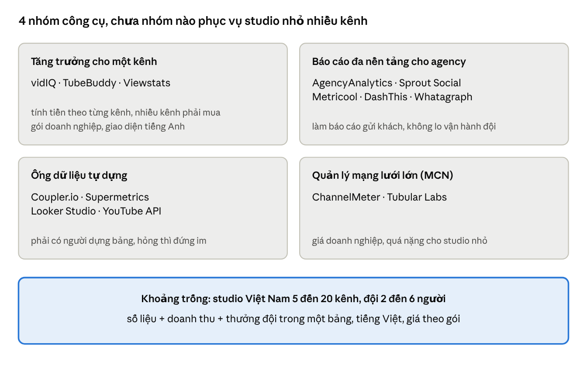
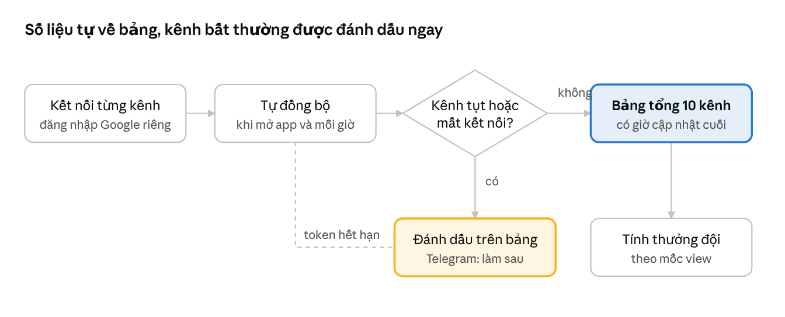
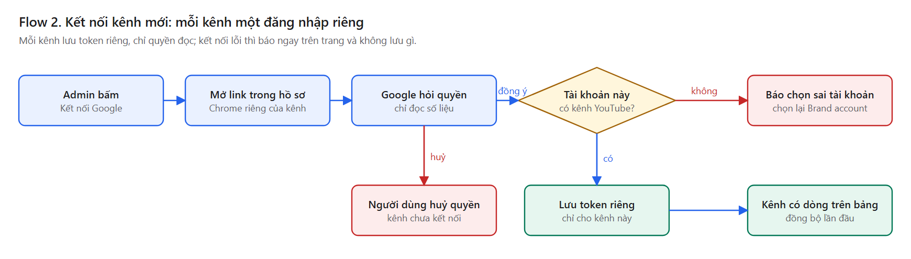
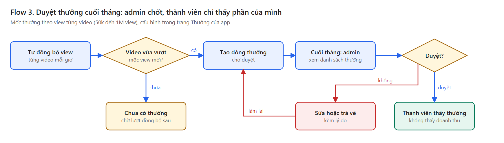

[🇻🇳 Tiếng Việt](README.md) · **🇬🇧 English**

# BTO-06: YOUTUBE HQ Market Research

Hoàng Văn Đức · Build to Own, Cohort 01 · 27/09/2026

## Summary

YOUTUBE HQ is a shared operations board for small Vietnamese YouTube studios running 5 to 20 channels for foreign markets: one screen with real metrics, revenue and team bonuses, with a separate login for each channel.

- **Who it's for:** Vietnamese YouTube studio owners with 5 to 20 channels and a team of 2 to 6 people (editing, filming, analytics), not technical. The first user is myself: 10 channels, a team of 4.
- **How it differs from what exists:** popular YouTube tools (vidIQ, TubeBuddy, Viewstats) charge per channel and only look at one channel; multi-channel tools (AgencyAnalytics, Coupler.io, Metricool) build reports for agencies and do not handle team operations. None of the tools listed combines metrics, revenue and team bonuses in one place, in Vietnamese, at a fixed plan price instead of per channel pricing.
- **What exactly to build:** the first version covers a Google connection per channel, automatic metrics sync, a 10 channel overview with last updated times, flags for channels that drop or lose connection, and asking about metrics in plain language through AI (MCP). No video publishing, competitor tracking or mobile app yet.

## Part 1. Market Research

### Market overview

The YouTube analytics tools market splits into 4 groups, and all 4 assume either a single channel or a large agency with someone to build reports. YouTube Studio is free but shows only one channel at a time, so anyone running 10 channels has to switch accounts 10 times.

Small multi-channel studios fall in between: too many channels for single channel tools, too small and too short on technical staff for agency tools and data pipelines.

### Main competitors and pricing

For 10 channels, the most popular tools cost about 166 to 200 USD per month, or require calling sales for an enterprise plan. Prices come from pricing pages and pricing reviews checked in July and August 2026.

| Competitor | Group | Price (USD) | Multi-channel | Estimated cost for 10 channels |
| --- | --- | --- | --- | --- |
| [vidIQ](https://1of10.com/blog/vidiq-pricing/) | Single channel growth | Boost 39/month or 199/year; Max 468/year | Each plan covers 1 channel; multiple channels need Enterprise, contact for price | 10 annual Boost plans: about 166/month |
| [TubeBuddy](https://1of10.com/blog/tubebuddy-pricing-review/) | Single channel growth | Pro 43.20/year; Legend 278.28/year | 1 license = 1 channel; Legend has 2 user seats | 10 Legend plans: about 232/month |
| [Viewstats](https://outlierkit.com/resources/viewstats-pricing/) | Growth, research | Pro 49.99/month; Business from 249/month | Business for teams and agencies, requires booking a call | Business: from 249/month |
| [AgencyAnalytics](https://agencyanalytics.com/pricing) | Agency reporting | 20 per client/month (billed yearly) | Many clients, white-label dashboards | 10 channels as 10 clients: about 200/month |
| [Metricool](https://metricool.com/pricing/) | Cross-platform reporting | Starter 16 to 29 EUR/month (5 to 10 brands) | By number of brands | Starter 10 brands: about 29 EUR/month |
| [Coupler.io](https://www.coupler.io/pricing) | DIY data pipeline | Starter 24, Active 99, Pro 199/month (billed yearly) | By number of source accounts | Active (15 accounts): 99/month, plus building your own board |
| YouTube Studio + Looker Studio | Free | 0 | Studio shows one channel at a time; Looker needs manual wiring | 0 USD but hours spent building and fixing |

The 10 channel cost column is multiplied from published prices, without regional discounts. [OverseerOS](https://www.overseeros.com/blog/best-multi-channel-youtube-analytics-tools) also lists ChannelMeter, Tubular Labs, Sprout Social, Whatagraph and DashThis in the multi-channel group.

### Teardown of 4 existing approaches

Each solves one piece, but none answers the studio owner's daily question: how are the 10 channels doing today, which channel is dropping, and how much bonus does each team member get.

**1. vidIQ (single channel growth tool)**

- **Problem it solves:** helps a creator find ideas and keywords and optimize videos so the channel grows faster.
- **Main features:** keyword research, tracking other channels, AI title and idea suggestions; paid plans use AI credits (Boost 2,000, Max 6,000 credits/month).
- **How it works:** sign in with one channel, use it on the web and via a browser extension. Boost and Max cover 1 channel only; multiple channels need Enterprise.
- **Weak for multi-channel studios:** no multi-channel overview on self-serve plans, no team roles, focused on growth rather than operations.

**2. AgencyAnalytics (agency reporting)**

- **Problem it solves:** marketing agencies must send regular reports to many clients without doing it by hand.
- **Main features:** 85+ data sources (including YouTube), unlimited dashboards and reports, white-label, unlimited staff and client users.
- **How it works:** each client is a "client", source accounts are connected to that client, 20 USD per client per month.
- **Weak for multi-channel studios:** built for sending reports to clients, with no team bonuses, daily tasks or channel drop alerts the way a studio needs; 10 channels cost about 200 USD/month.

**3. Coupler.io + Looker Studio (DIY data pipeline)**

- **Problem it solves:** pulls data from 400+ sources into Google Sheets, Looker Studio or BI to build your own reports.
- **Main features:** daily refresh schedule (hourly on Pro), priced by number of source accounts.
- **How it works:** each channel is a source account, data flows into a table, then the user draws their own dashboard.
- **Weak for multi-channel studios:** needs someone who can build the board; when a channel loses access, the numbers freeze and the board does not say so.

**4. How I do it today (the real competitor: doing it by hand)**

- **Today:** open YouTube Studio for each channel, a Telegram bot reports revenue every 3 hours, an extension logs to Google Sheets, about 30 minutes a day.
- **Weak:** numbers scattered across Telegram, Sheets and apps; the bot once reported running without producing results; channel drops are noticed days late. As of 27/09/2026 only 1 of 10 channels is connected to YOUTUBE HQ.

### Market Gap Matrix

The biggest gap is team operations: view-based bonuses, channel drop alerts and Vietnamese. "Combining multi-channel metrics" is already done by others, but it is expensive or DIY.

| Needs of a 10 channel studio | vidIQ | TubeBuddy | AgencyAnalytics | Coupler + Looker | YouTube Studio | YOUTUBE HQ |
| --- | --- | --- | --- | --- | --- | --- |
| Combine many channels without an enterprise plan | No | No | Yes | Yes, DIY | No | Yes |
| Separate login per channel, no shared token | Not seen | Not seen | Not seen | Not seen | Yes | Yes |
| Team roles, revenue visible only to admins | Not seen | 2 user seats | Has staff users | Depends on builder | By channel permission | Yes |
| Team bonus by per-video view milestones | Not seen | Not seen | Not seen | Not seen | No | Yes |
| Alerts for dropping or disconnected channels | Not seen | Not seen | Not seen | No | No | In progress |
| Ask about metrics in plain language via AI (MCP) | Not seen | Not seen | Not seen | No | No | Yes |
| Vietnamese, VND pricing | No | No | No | No | Vietnamese | Yes |
| Monthly cost for 10 channels (USD) | about 166 | about 232 | about 200 | from 99 + build time | 0 | about 20 (proposed) |

"Not seen" means not found on the pricing pages and reviews opened, not tested hands-on. The YOUTUBE HQ column reflects the app currently on my machine (Bonus page, roles, youtube-hq MCP) and ticket HOA-8 for alerts.

## Part 2. Product Direction

Chosen direction: an operations board for Vietnamese multi-channel YouTube studios, sold as fixed plans in VND, about 8 times cheaper than buying vidIQ for each channel.

### ICP: ideal customer profile

- **Who:** YouTube studio owners in Vietnam running 5 to 20 channels for the US and European markets; a team of 2 to 6 covering editing, filming and analytics.
- **Traits:** no developers; pay salaries or bonuses to the team by views; afraid of channels being linked, so they keep a separate Google account per channel.
- **Not the ICP:** single channel creators (already have vidIQ, TubeBuddy), multi-platform marketing agencies (already have AgencyAnalytics), MCNs with hundreds of channels.
- **First user:** myself, 10 channels, a team of 4, currently spending about 30 minutes a day.

### Their problems

1. They open YouTube Studio for each channel, switching accounts constantly, with no shared screen.
2. Channel view drops or lost access are noticed days late.
3. Team bonuses by views are calculated by hand in Sheets, error-prone and a source of disputes.
4. Foreign tools charge per channel in USD: 10 channels already cost 166 to 232 USD a month.

### Proposed pricing (proposal, not yet validated with real customers)

| Plan | Channels | Users | Price/month |
| --- | --- | --- | --- |
| Free | 2 | 1 | 0 VND |
| Studio | 10 | 5 | 499,000 VND (about 19 USD) |
| Team | 30 | 15 | 1,290,000 VND (about 50 USD) |

Rationale: the Studio plan for 10 channels is about 1/8 the cost of vidIQ Boost for 10 channels and 1/10 of AgencyAnalytics. Converted at about 26,000 VND/USD.

### USP

**One board for the whole studio: real metrics for every channel, revenue and team bonuses, a separate login per channel, in Vietnamese, priced by plan rather than per channel.**

### Why choose YOUTUBE HQ over what exists

1. **Cheap with many channels:** adding channels does not multiply the price; 10 channels cost about 19 USD versus 166 to 232 USD.
2. **Runs operations, not just reports:** view milestone bonuses, team roles, revenue visible only to admins.
3. **Safe for many channels:** each channel is read only with its own login, read-only scopes, tokens stay on my machine.
4. **Ask in plain language:** ask Claude "which channel dropped this week" via MCP, no dashboard building needed.

To validate before building further: interview 5 studio owners to confirm the team bonus problem and the 499,000 VND price.

## Part 3. Initial Product Spec

The first version does one thing well: the studio owner opens the app and sees how the 10 channels are doing today, and right away which channel is abnormal. The full 7 section spec lives in the product repo (Private): `spec.md`.

### Main flows

**Flow 1. Daily flow: metrics arrive on the board automatically**

The most important error branch is an expired token: that channel switches to "disconnected" on the board right away, instead of showing old numbers as new.

**Flow 2. Connect a new channel**

The admin opens the connect link in a separate Chrome profile for each channel, so Google accounts never share one browser session. Picking an account with no channel, or revoking access, saves nothing.

**Flow 3. Approve monthly bonuses**

Bonuses only become money after admin approval; members see their own bonus but not channel revenue.

### Main user stories

1. As a studio owner, I want to connect each channel with its own Google account, so channels never share a login.
2. As a studio owner, I want one screen showing views, watch time, net subscribers and 28 day revenue for all 10 channels, so I don't open Studio 10 times.
3. As a studio owner, I want dropping channels, data older than 12 hours or lost connections flagged right on the board, so I can act the same day (Telegram alerts come later).
4. As an editor on the team, I want to see which view milestones my videos hit and how much bonus I get, without seeing channel revenue.
5. As a studio owner, I want to ask Claude "which channel dropped this week" and get real numbers, without building reports myself.

### User and admin features

| Feature | Who uses it | First version |
| --- | --- | --- |
| Overview of all channels, last updated time per row | Admin, analyst | Yes |
| Channel detail: Studio metrics, 10 latest videos | Admin, analyst | Yes |
| My bonus by view milestones | Editor, filmer | Yes |
| Ask about metrics in plain language via MCP | Admin | Yes |
| Connect and disconnect Google channels | Admin | Yes |
| Invite members, assign roles, hide revenue from staff | Admin | Yes |
| Set bonus milestones, approve monthly bonuses | Admin | Yes |
| Set alert thresholds and destination (Telegram) | Admin | Later |
| View sync logs and per-channel errors | Admin | Yes |
| Publish, edit, delete videos; competitor tracking; mobile app | Nobody | Not in this round |

### Architecture

The app runs on the studio's own machine (Electron), a local backend holds each channel's token and answers only that machine, calling the YouTube Data API and Analytics API with read-only scopes. The full architecture diagram with error branches lives in the product repo (`docs/architecture.html`). The build is split into 8 tickets on Linear (HOA-5 to HOA-12), milestone 04/10/2026.

## Sources

Pages opened on 27/09/2026; prices may vary by region.

- [vidIQ Pricing 2026, 1of10](https://1of10.com/blog/vidiq-pricing/) (prices checked July 2026)
- [TubeBuddy Pricing and Review, 1of10](https://1of10.com/blog/tubebuddy-pricing-review/) (prices checked July 2026)
- [ViewStats Pricing, OutlierKit](https://outlierkit.com/resources/viewstats-pricing/) (prices checked 06/08/2026)
- [AgencyAnalytics Pricing](https://agencyanalytics.com/pricing)
- [Metricool Pricing](https://metricool.com/pricing/)
- [Coupler.io Pricing](https://www.coupler.io/pricing)
- [10 Best Multi-Channel YouTube Analytics Tools, OverseerOS](https://www.overseeros.com/blog/best-multi-channel-youtube-analytics-tools)
- Internal data: BTO-02 and BTO-04 drafts, youtube-hq MCP on 27/09/2026.
